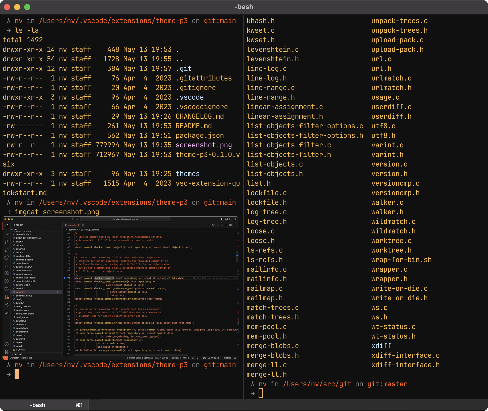

# P3 Theme for iTerm2

A minimal dark theme for iTerm2 inspired by the colors seen on the
[monochrome monitors](https://en.wikipedia.org/wiki/Monochrome_monitor) of the
80s.

## Installation

1. Type CMD+i
2. Navigate to Colors tab
3. Click on Load Presets
4. Click on Import
5. Select the "**P3.itermcolors**" file

Click on Load Presets and choose the newly installed P3 color scheme.

## Related projects

- [P3 Theme for Visual Studio Code](https://github.com/nvartolomei/vscode-theme-p3)
